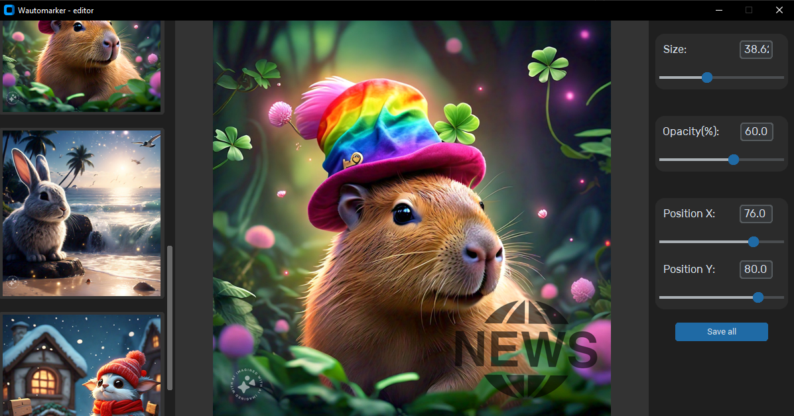

# Wautomarker
Herramienta gráfica (Tkinter + PIL) para añadir marcas de agua a imágenes de forma interactiva.

## Características
- Ajuste de tamaño, opacidad y posición de la marca de agua.
- Vista previa en tiempo real.
- Exportación a PNG o JPEG.

## Instalación

1. Clona el repositorio.
2. Crea y activa un entorno virtual:
    ```bash
    python -m venv env
    source venv/bin/activate # Linux/Mac
    .env\Scripts\Activate.ps1 # Windows PowerShell
    ```
3. Instala las dependencias:
    ```bash
    pip install -r requirements.txt
    ```
## Uso
```bash
python main.py
```
## Licencia
MIT © 2025 DAIKIFG

> **🚧 Grammar Warning**  
> This project may include some “creative” English.  
> Spot a weird phrase? Please don’t crucify me—  
> My English isn't the best but I'm still learning 💪